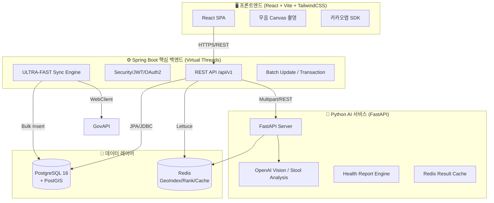

<div align="center">

# 💩 DayPoo

**대한민국 건강한 배변 문화를 위한 공간 정보 및 AI 분석 서비스**

_React · Spring Boot (Virtual Threads) · Python/FastAPI · OpenAI Vision_

[](https://github.com/cjoh0407-ctrl/daypoo)
[](./frontend)
[](./backend)
[](./ai-service)
[](./LICENSE)

</div>

---

## 📖 프로젝트 소개

**DayPoo(대똥여지도)**는 대한민국 화장실 정보를 지도 위에 시각화하고, 사용자의 배변 기록을 AI로 분석하여 건강 솔루션을 제공하는 **프리미엄 건강 관리 및 위치 기반 서비스**입니다.

전국 **약 50만 건**의 방대한 공공데이터를 **Java 21 가상 스레드(Virtual Threads)** 기반 엔진으로 초고속 동기화하며, **PostGIS** 정밀 공간 쿼리와 **OpenAI Vision** 기반의 지능형 리포팅 시스템을 통해 사용자에게 독보적인 건강 경험을 선사합니다.

---

## 🏗️ 시스템 아키텍처 (C4 Model - Container Level)

DayPoo는 고성능 데이터 처리와 AI 확장을 위해 **서비스 지향 아키텍처**를 채택하였습니다.



---

## 🛠️ 기술 스택 (Technology Stack)

| 파트           | 기술                           | 설명                                                 |
| :------------- | :----------------------------- | :--------------------------------------------------- |
| **Frontend**   | React 18+, TypeScript, Vite    | WebRTC 기반 무음 캡처 및 고성능 지도 UI 구현         |
|                | TailwindCSS 4, Framer Motion   | 모던한 애니메이션 및 유틸리티 퍼스트 스타일링        |
| **Backend**    | Spring Boot 3.4 (Java 21)      | **가상 스레드(Virtual Threads)** 기반 병렬 처리      |
|                | JdbcTemplate (Batch), JPA      | **reWriteBatchedInserts**를 통한 50만 건 삽입 최적화 |
|                | Spring Security + JWT + OAuth2 | Kakao/Google 소셜 로그인 및 /me 프로필 API 제공      |
| **AI Service** | FastAPI (Python 3.12)          | **In-Memory Pipeline** 기반 무저장 이미지 분석       |
|                | OpenAI GPT-4o Vision           | 브리스톨 척도 및 건강 지표 정밀 분석                 |
| **Data Layer** | PostgreSQL 16 + PostGIS        | 50만 건 공간 데이터 처리 및 공간 인덱싱(GIST)        |
|                | Redis (Geo, ZSET, Cache)       | **지역별 실시간 랭킹** 및 분석 결과 캐싱             |
| **DevOps**     | GitHub Actions, Docker, Husky  | 컨테이너 기반 CI/CD 및 자동 코드 포맷팅(Spotless)    |

---

## ✨ 핵심 고도화 기능 (Advanced Features)

### 1. 🚀 초고속 공공데이터 동기화 엔진 (Virtual Thread Engine)

- **병렬 파이프라이닝**: 가상 스레드를 활용하여 1,000개 이상의 페이지를 동시 페칭.
- **DB 쓰기 최적화**: 트랜잭션 내 `batchUpdate`와 JDBC 옵션을 결합하여 대량 삽입 성능 극대화.
- **중복 체크 최적화**: 시작 시 모든 관리번호를 로컬 `ConcurrentHashMap`에 사전 로딩하여 DB I/O 90% 절감.

### 2. 🤖 AI 건강 리포트 & Vision 분석 (In-Memory Pipeline)

- **무음/무저장 원칙**: WebRTC Canvas 추출 및 메모리 상의 Byte Array 전송으로 개인정보 보호 및 셔터음 제거.
- **지능형 리포팅**: 7일간의 기록을 종합하여 식습관 및 소화기 건강에 대한 전문적인 AI 솔루션 제공.

### 3. 🏆 실시간 지역별 랭킹 시스템

- **행정동 자동 추출**: 카카오 역지오코딩을 통해 배변 시점의 위치를 법정동/행정동 단위로 자동 분류.
- **Redis 실시간 집계**: Redis ZSET을 활용하여 우리 동네 배변 랭킹 및 칭호(Achievement) 시스템 연동.

---

## 🚀 시작하기 (Quick Start)

### 1단계: 환경 설정

루트 폴더의 `.env` 파일을 작성합니다. 백엔드와 AI 서비스는 이를 공유합니다.

```bash
cp .env.example .env
# OPENAI_API_KEY, PUBLIC_DATA_API_KEY, KAKAO_CLIENT_ID 등 설정
```

### 2단계: 프로젝트 실행 (Docker)

```bash
docker-compose up -d
```

### 3단계: 로컬 개발 실행

- **Frontend**: `cd frontend && npm install && npm run dev`
- **Backend**: `cd backend && ./gradlew bootRun`
- **AI Service**: `cd ai-service && python main.py`

---

## 📁 디렉토리 구조

```
daypoo/
├── frontend/                  # React + Vite SPA (UI/UX)
├── backend/                   # Spring Boot 3.4 (Core Business Logic)
│   ├── api/                   # Controller & DTO
│   ├── entity/                # JPA Domain Entities
│   ├── service/               # Optimized Service Engines
│   └── repository/            # PostGIS & Data Access
├── ai-service/                # FastAPI AI Microservice
│   ├── app/api/               # Analysis & Report Endpoints
│   └── app/services/          # OpenAI Vision & Prompt Engineering
├── docs/                      # 아키텍처, 성능 분석 보고서 및 온보딩 가이드
└── docker-compose.yml         # 로컬 인프라 (PostgreSQL, Redis)
```

---

## 📅 마일스톤 (Milestones)

- **✅ 2026.03.18 - 가상 스레드 기반 50만 건 초고속 동기화 엔진 구축 완료**
- **✅ 2026.03.18 - 내 정보 조회(Me) 및 프로필 조회 API 개발 완료**
- **✅ 2026.03.18 - AI Vision 무음 촬영 및 In-Memory 파이프라인 정비 완료**
- **✅ 2026.03.18 - 지역별 실시간 랭킹 및 칭호/업적 시스템 엔진 구현 완료**

---

## 📄 라이선스

이 프로젝트는 [ISC License](./LICENSE)를 따릅니다.
