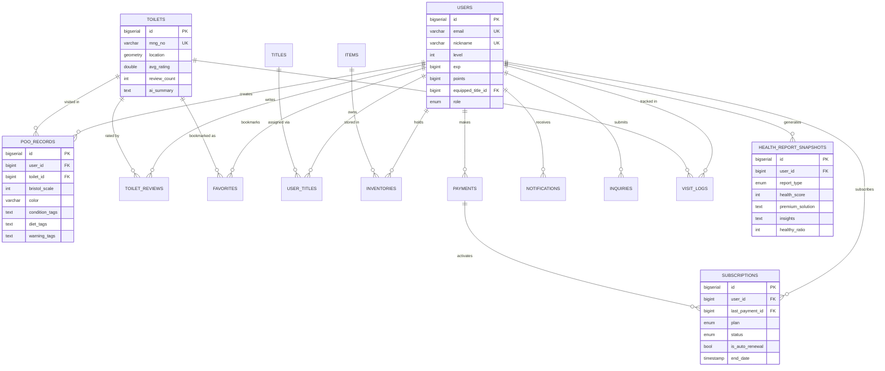
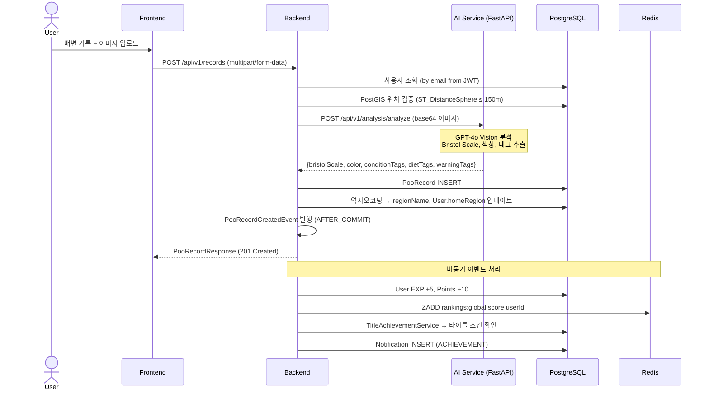
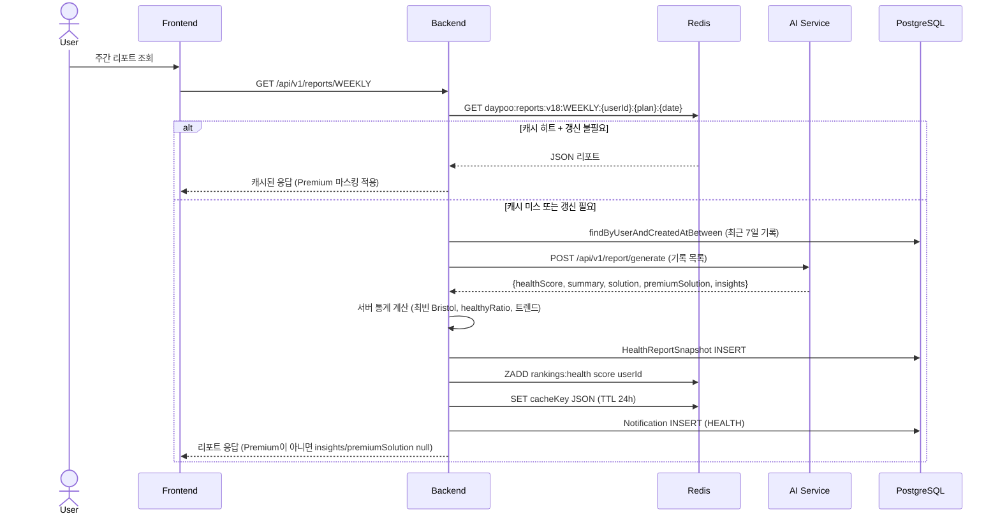
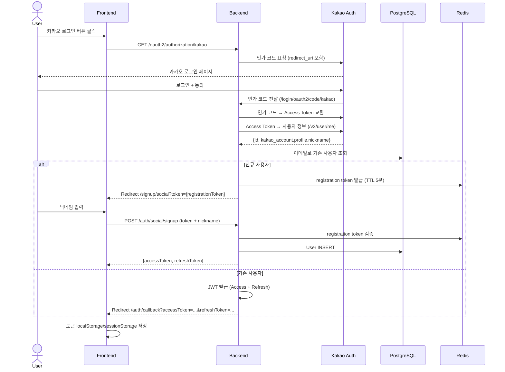

# DayPoo 프로젝트 코드 분석 보고서

> 분석 기준: 실제 소스 코드 직접 분석 (README.md 등 문서 파일 제외)
> 분석 일자: 2026-04-06

---

## 1. 디렉토리 구조

### 백엔드 (Layered Architecture)

```
backend/src/main/java/com/daypoo/api/
├── ApiApplication.java            # 엔트리포인트 (timezone 설정, 메일 헬스체크)
├── controller/                    # 20개 REST 컨트롤러
├── service/                       # 31개 비즈니스 로직 서비스
├── repository/                    # 19개 JPA/QueryDSL 레포지터리
├── entity/                        # 18개 JPA 엔티티
│   └── enums/                     # Role, SubscriptionPlan, AchievementType 등 열거형
├── dto/                           # Request / Response DTO (90+)
├── security/                      # JWT 필터, OAuth2 핸들러, SecurityConfig
├── global/
│   ├── exception/                 # GlobalExceptionHandler, ErrorCode, BusinessException
│   ├── aop/                       # RateLimitAspect, ServiceLoggingAspect
│   ├── filter/                    # MaintenanceModeFilter, JwtAuthenticationFilter, MDCFilter
│   └── config/                    # RestTemplateConfig, AsyncConfig
├── event/                         # PooRecordCreatedEvent, 이벤트 리스너
├── mapper/                        # MapStruct DTO 매퍼
├── util/                          # ChosungUtils, GeometryUtil 등
└── simulation/                    # 부하 테스트용 봇 오케스트레이터
backend/src/main/resources/
├── application.yml                # 기본 설정 (DB, Redis, JWT, OAuth2)
├── application-prod.yml           # 프로덕션 설정 (커넥션 풀 축소)
└── db/migration/                  # V1~V28 Flyway SQL 마이그레이션
```

**아키텍처 패턴:** Classic Layered Architecture (Controller → Service → Repository)  
이벤트 기반 비동기 사이드이펙트 처리 (`@TransactionalEventListener` + `@Async`)

### 프론트엔드 (React SPA)

```
frontend/src/
├── App.tsx                        # 라우트 정의, React.lazy 코드 스플리팅
├── main.tsx                       # ReactDOM 렌더 진입점
├── pages/                         # 15+ 지연 로딩 페이지 컴포넌트
├── components/
│   ├── auth/                      # LoginForm, SignupForm, SocialLoginButtons
│   ├── map/                       # MapView, ToiletPopup, ReviewModal, VisitModal
│   └── hero/                      # 히어로 섹션 애니메이션 컴포넌트
├── context/                       # AuthContext, NotificationContext, TransitionContext
├── services/                      # apiClient.ts (Fetch 기반 HTTP 클라이언트)
├── hooks/                         # useGeoTracking, useRankings, useToilets 등
├── types/                         # api.ts TypeScript 인터페이스
└── utils/                         # geoUtils, framerFeatures
```

**아키텍처 패턴:** Context API 기반 상태 관리, 페이지 단위 코드 스플리팅

---

## 2. 기술 스택 상세

### Frontend

| 카테고리          | 라이브러리                     | 버전    |
| ----------------- | ------------------------------ | ------- |
| **프레임워크**    | React                          | 19.2.0  |
| **라우터**        | React Router DOM               | 7.13.1  |
| **빌드 도구**     | Vite                           | 7.3.1   |
| **언어**          | TypeScript                     | 5.8.2   |
| **스타일링**      | Tailwind CSS                   | 4.2.1   |
| **애니메이션**    | Framer Motion                  | 12.36.0 |
| **차트**          | Recharts                       | 3.8.0   |
| **아이콘**        | Lucide React                   | 0.576.0 |
| **아바타**        | DiceBear                       | 9.4.2   |
| **캐러셀**        | Swiper                         | 12.1.2  |
| **마크다운**      | React Markdown                 | 10.1.0  |
| **결제 UI**       | TossPayments SDK               | 1.9.2   |
| **PWA**           | vite-plugin-pwa                | 1.2.0   |
| **이미지 최적화** | vite-plugin-imagemin           | 0.6.1   |
| **린트/포맷**     | ESLint 9.39.3 + Prettier 3.8.1 | -       |

기준 파일: `frontend/package.json`

### Backend

| 카테고리            | 라이브러리                          | 버전                  |
| ------------------- | ----------------------------------- | --------------------- |
| **프레임워크**      | Spring Boot                         | 3.4.3                 |
| **언어**            | Java (Virtual Threads)              | 21                    |
| **API 문서**        | SpringDoc OpenAPI                   | 2.8.5                 |
| **JWT**             | JJWT                                | 0.12.5                |
| **OAuth2**          | Spring Security OAuth2              | (Spring Boot managed) |
| **ORM**             | Spring Data JPA + Hibernate Spatial | (Spring Boot managed) |
| **QueryDSL**        | querydsl-jpa (Jakarta)              | 5.0.0                 |
| **코드 생성**       | MapStruct                           | 1.5.5.Final           |
| **DB 마이그레이션** | Flyway                              | (Spring Boot managed) |
| **모니터링**        | Micrometer + Prometheus             | (Spring Boot managed) |
| **이메일**          | Spring Mail (Gmail SMTP)            | (Spring Boot managed) |
| **코드 포맷**       | Spotless + Google Java Format       | 1.19.2                |
| **빌드**            | Gradle                              | 8+                    |

기준 파일: `backend/build.gradle`

### DB / AI·ML / Infra·DevOps

| 카테고리                 | 기술                                   | 버전     |
| ------------------------ | -------------------------------------- | -------- |
| **DB**                   | PostgreSQL + PostGIS                   | 16 + 3.4 |
| **캐시**                 | Redis                                  | 7-alpine |
| **검색**                 | OpenSearch                             | -        |
| **AI API**               | OpenAI GPT-4o Vision                   | -        |
| **AI 오케스트레이션**    | LangChain + LangChain OpenAI           | -        |
| **AI 서비스 프레임워크** | FastAPI (Python)                       | 3.12     |
| **데이터 검증**          | Pydantic v2                            | -        |
| **인프라 IaC**           | Terraform                              | -        |
| **컨테이너**             | Docker + Docker Compose                | -        |
| **CI/CD**                | GitHub Actions                         | -        |
| **클라우드**             | AWS (EC2, RDS, CloudFront, S3, Lambda) | -        |

기준 파일: `docker-compose.yml`, `backend/src/main/resources/application.yml`

---

## 3. Entity / Model 분석

### 전체 Entity 목록 (18개)

| #   | Entity 클래스        | 테이블명                |
| --- | -------------------- | ----------------------- |
| 1   | User                 | users                   |
| 2   | PooRecord            | poo_records             |
| 3   | Toilet               | toilets                 |
| 4   | ToiletReview         | toilet_reviews          |
| 5   | Subscription         | subscriptions           |
| 6   | Payment              | payments                |
| 7   | Item                 | items                   |
| 8   | Inventory            | inventories             |
| 9   | Title                | titles                  |
| 10  | UserTitle            | user_titles             |
| 11  | HealthReportSnapshot | health_report_snapshots |
| 12  | Favorite             | favorites               |
| 13  | Notification         | notifications           |
| 14  | VisitLog             | visit_logs              |
| 15  | Inquiry              | inquiries               |
| 16  | FAQ                  | faqs                    |
| 17  | SystemLog            | system_log              |
| 18  | SystemSettings       | system_settings         |

### 주요 Entity 상세

#### User (`users`)

| 컬럼              | 타입         | 제약                 | 설명                     |
| ----------------- | ------------ | -------------------- | ------------------------ |
| id                | BIGSERIAL    | PK                   |                          |
| email             | VARCHAR(100) | UNIQUE, NOT NULL     |                          |
| nickname          | VARCHAR(50)  | UNIQUE, NOT NULL     |                          |
| password          | VARCHAR      | nullable             | 소셜 로그인은 null       |
| level             | INT          | DEFAULT 1            | 최대 30                  |
| exp               | BIGINT       | DEFAULT 0            | 레벨업 기준: level × 100 |
| points            | BIGINT       | DEFAULT 0            | 상점 재화                |
| role              | ENUM         | NOT NULL             | ROLE_USER, ROLE_ADMIN    |
| equipped_title_id | BIGINT       | FK(titles), nullable | 현재 장착 타이틀         |
| home_region       | VARCHAR      | nullable             | 마지막 기록 지역         |

#### PooRecord (`poo_records`)

| 컬럼           | 타입        | 제약                      | 설명                            |
| -------------- | ----------- | ------------------------- | ------------------------------- |
| id             | BIGSERIAL   | PK                        |                                 |
| user_id        | BIGINT      | FK(users), NOT NULL       |                                 |
| toilet_id      | BIGINT      | FK(toilets), **nullable** | V27에서 nullable로 변경         |
| bristol_scale  | INT         |                           | 1~7 (Bristol Stool Scale)       |
| color          | VARCHAR(50) |                           | AI 분석 결과 색상               |
| condition_tags | TEXT        |                           | 쉼표 구분 문자열                |
| diet_tags      | TEXT        |                           | 쉼표 구분 문자열                |
| warning_tags   | TEXT        |                           | 쉼표 구분 문자열                |
| region_name    | VARCHAR(50) |                           | 지역명 (역지오코딩)             |
| created_at     | TIMESTAMP   |                           | 생성 후 불변 (immutable record) |

#### Toilet (`toilets`)

| 컬럼         | 타입                  | 제약        | 설명                        |
| ------------ | --------------------- | ----------- | --------------------------- |
| id           | BIGSERIAL             | PK          |                             |
| mng_no       | VARCHAR               | UNIQUE      | 공공데이터 관리번호         |
| name         | VARCHAR               | NOT NULL    |                             |
| address      | VARCHAR               |             |                             |
| location     | geometry(Point, 4326) | GIST 인덱스 | PostGIS 공간 데이터         |
| is_24h       | BOOLEAN               |             | 24시간 운영 여부            |
| is_unisex    | BOOLEAN               |             | 남녀공용 여부               |
| avg_rating   | DOUBLE                | DEFAULT 0   | 리뷰 평균 (트리거 업데이트) |
| review_count | INT                   | DEFAULT 0   |                             |
| ai_summary   | TEXT                  | nullable    | AI 생성 한줄 요약           |

#### Subscription (`subscriptions`)

| 컬럼            | 타입      | 제약                   | 설명                                           |
| --------------- | --------- | ---------------------- | ---------------------------------------------- |
| id              | BIGSERIAL | PK                     |                                                |
| user_id         | BIGINT    | FK(users)              |                                                |
| last_payment_id | BIGINT    | FK(payments), nullable |                                                |
| plan            | ENUM      |                        | BASIC(0원), PRO(4900원/월), PREMIUM(9900원/월) |
| status          | ENUM      |                        | ACTIVE, CANCELLED, EXPIRED                     |
| is_auto_renewal | BOOLEAN   | DEFAULT true           |                                                |
| start_date      | TIMESTAMP |                        |                                                |
| end_date        | TIMESTAMP |                        |                                                |

#### HealthReportSnapshot (`health_report_snapshots`)

| 컬럼                   | 타입    | 설명                                          |
| ---------------------- | ------- | --------------------------------------------- |
| report_type            | ENUM    | DAILY, WEEKLY, MONTHLY                        |
| health_score           | INT     | 0~100점                                       |
| summary                | TEXT    | AI 생성 요약                                  |
| solution               | TEXT    | 일반 해결책                                   |
| premium_solution       | TEXT    | 프리미엄 전용 솔루션                          |
| insights               | TEXT    | 프리미엄 전용 인사이트                        |
| healthy_ratio          | INT     | Bristol 3-4 비율(%)                           |
| improvement_trend      | VARCHAR | IMPROVING / STABLE / DECLINING (MONTHLY)      |
| bristol_distribution   | TEXT    | JSON 직렬화 {1:count, 2:count, ...} (MONTHLY) |
| weekly_health_scores   | VARCHAR | 주차별 점수 쉼표 구분 (MONTHLY)               |
| avg_daily_record_count | DOUBLE  | 일평균 기록 수 (MONTHLY)                      |

### ERD (Mermaid)



---

## 4. Controller / Router 분석

### 전체 REST 엔드포인트 목록

#### 인증 (`/api/v1/auth`) — `AuthController`

| 메서드 | 경로                        | 핸들러           | 인증 | 설명                          |
| ------ | --------------------------- | ---------------- | ---- | ----------------------------- |
| GET    | /api/v1/auth/me             | getCurrentUser   | ✓    | 내 프로필 조회                |
| PATCH  | /api/v1/auth/me             | updateProfile    | ✓    | 닉네임 수정                   |
| PATCH  | /api/v1/auth/password       | changePassword   | ✓    | 비밀번호 변경                 |
| GET    | /api/v1/auth/check-email    | checkEmail       | ✗    | 이메일 중복 확인 (20회/분)    |
| GET    | /api/v1/auth/check-nickname | checkNickname    | ✗    | 닉네임 중복 확인              |
| POST   | /api/v1/auth/signup         | signUp           | ✗    | 이메일 회원가입 (200회/10분)  |
| POST   | /api/v1/auth/login          | login            | ✗    | 로그인 + JWT 발급 (200회/5분) |
| POST   | /api/v1/auth/social/signup  | socialSignUp     | ✗    | 소셜 가입 완료 (닉네임 등록)  |
| GET    | /api/v1/auth/find-id        | findIdByNickname | ✗    | 닉네임으로 이메일 찾기        |
| POST   | /api/v1/auth/exchange-code  | exchangeCode     | ✗    | OAuth2 인가 코드 교환         |
| POST   | /api/v1/auth/refresh        | refresh          | ✗    | Access Token 갱신             |
| POST   | /api/v1/auth/logout         | logout           | ✓    | 로그아웃 (Redis blacklist)    |
| DELETE | /api/v1/auth/me             | withdraw         | ✓    | 계정 탈퇴 (cascade delete)    |

#### 배변 기록 (`/api/v1/records`) — `PooRecordController`

| 메서드 | 경로                            | 핸들러           | 인증 | 설명                                  |
| ------ | ------------------------------- | ---------------- | ---- | ------------------------------------- |
| POST   | /api/v1/records/check-in        | checkIn          | ✓    | 빠른 체크인 (150m 이내 타이머 시작)   |
| POST   | /api/v1/records                 | createRecord     | ✓    | 기록 생성 + AI 분석 + EXP/포인트 지급 |
| POST   | /api/v1/records/analyze         | analyzeImageOnly | ✗    | AI 이미지 분석만 (기록 미저장)        |
| GET    | /api/v1/records                 | getMyRecords     | ✓    | 내 기록 목록 (페이지네이션, DESC)     |
| GET    | /api/v1/records/{id}            | getRecord        | ✓    | 특정 기록 상세                        |
| GET    | /api/v1/records/my-visit-counts | getMyVisitCounts | ✓    | 화장실별 방문 횟수 맵                 |

#### 화장실 (`/api/v1/toilets`) — `ToiletController`

| 메서드 | 경로                      | 핸들러        | 인증 | 설명                                                 |
| ------ | ------------------------- | ------------- | ---- | ---------------------------------------------------- |
| GET    | /api/v1/toilets           | searchToilets | ✗    | PostGIS 반경 검색 (lat, lon, radius=1000, limit=300) |
| GET    | /api/v1/toilets/search    | textSearch    | ✗    | OpenSearch 텍스트 검색 (초성 지원)                   |
| GET    | /api/v1/toilets/emergency | getEmergency  | ✗    | 가장 가까운 화장실 TOP 3                             |

#### 화장실 리뷰 (`/api/v1/toilets/{id}/reviews`) — `ToiletReviewController`

| 메서드 | 경로                                 | 인증 | 설명                                 |
| ------ | ------------------------------------ | ---- | ------------------------------------ |
| POST   | /api/v1/toilets/{id}/reviews         | ✓    | 리뷰 작성 (1~5점, 이모지 태그, 댓글) |
| GET    | /api/v1/toilets/{id}/reviews         | ✗    | 리뷰 목록 (page, size, sort)         |
| GET    | /api/v1/toilets/{id}/reviews/recent  | ✗    | 최근 5개 리뷰                        |
| GET    | /api/v1/toilets/{id}/reviews/summary | ✗    | AI 요약 + 평점 통계                  |

#### 건강 리포트 (`/api/v1/reports`, `/api/v1/health`) — `ReportController`, `HealthReportController`

| 메서드 | 경로                          | 인증 | 설명                                       |
| ------ | ----------------------------- | ---- | ------------------------------------------ |
| GET    | /api/v1/reports/{type}        | ✓    | AI 리포트 생성/조회 (DAILY/WEEKLY/MONTHLY) |
| GET    | /api/v1/reports/history       | ✓    | 리포트 이력 (PRO/PREMIUM)                  |
| GET    | /api/v1/reports/trend         | ✓    | 건강 점수 트렌드 (PRO/PREMIUM)             |
| GET    | /api/v1/reports/patterns      | ✓    | 방문 패턴 분석 (PRO/PREMIUM)               |
| GET    | /api/v1/health/reports/weekly | ✓    | 주간 건강 리포트                           |

#### 랭킹 (`/api/v1/rankings`) — `RankingController`

| 메서드 | 경로                    | 인증 | 설명                |
| ------ | ----------------------- | ---- | ------------------- |
| GET    | /api/v1/rankings/global | ✗    | 글로벌 랭킹 TOP 100 |
| GET    | /api/v1/rankings/health | ✗    | 건강 챔피언 랭킹    |
| GET    | /api/v1/rankings/region | ✗    | 지역별 랭킹         |

#### 알림 (`/api/v1/notifications`) — `NotificationController`

| 메서드 | 경로                                | 인증      | 설명                         |
| ------ | ----------------------------------- | --------- | ---------------------------- |
| POST   | /api/v1/notifications/sse-token     | ✓         | SSE 토큰 발급 (30초 TTL JWT) |
| GET    | /api/v1/notifications/subscribe     | 토큰 쿼리 | SSE 구독 (실시간 스트림)     |
| GET    | /api/v1/notifications               | ✓         | 알림 목록                    |
| PATCH  | /api/v1/notifications/{id}/read     | ✓         | 읽음 처리                    |
| POST   | /api/v1/notifications/mark-all-read | ✓         | 전체 읽음 처리               |
| DELETE | /api/v1/notifications/{id}          | ✓         | 알림 삭제                    |

#### 상점/인벤토리 (`/api/v1/shop`) — `ShopController`

| 메서드 | 경로                               | 인증 | 설명                         |
| ------ | ---------------------------------- | ---- | ---------------------------- |
| GET    | /api/v1/shop/items                 | ✓    | 상점 아이템 목록 (type 필터) |
| POST   | /api/v1/shop/purchase              | ✓    | 아이템 구매 (포인트 차감)    |
| GET    | /api/v1/shop/inventory             | ✓    | 내 인벤토리                  |
| POST   | /api/v1/shop/inventory/{id}/toggle | ✓    | 아이템 장착/해제             |
| GET    | /api/v1/shop/titles                | ✓    | 타이틀 목록 + 보유 여부      |
| POST   | /api/v1/shop/titles/{id}/equip     | ✓    | 타이틀 장착                  |
| POST   | /api/v1/shop/titles/{id}/acquire   | ✓    | 타이틀 획득                  |
| DELETE | /api/v1/shop/titles/equip          | ✓    | 타이틀 해제                  |

#### 결제/구독 (`/api/v1/payments`, `/api/v1/subscriptions`)

| 메서드 | 경로                               | 인증 | 설명                                         |
| ------ | ---------------------------------- | ---- | -------------------------------------------- |
| POST   | /api/v1/payments/confirm           | ✓    | 토스 결제 승인 (paymentKey, orderId, amount) |
| GET    | /api/v1/subscriptions/me           | ✓    | 내 구독 정보                                 |
| POST   | /api/v1/subscriptions/cancel       | ✓    | 구독 취소                                    |
| PATCH  | /api/v1/subscriptions/auto-renewal | ✓    | 자동갱신 토글                                |
| GET    | /api/v1/subscriptions/history      | ✓    | 구독 이력                                    |

#### 기타 (즐겨찾기, 고객지원, 관리자)

| 메서드              | 경로                         | 설명                     |
| ------------------- | ---------------------------- | ------------------------ |
| POST/GET/DELETE     | /api/v1/favorites/{toiletId} | 즐겨찾기 추가/조회/삭제  |
| GET                 | /api/v1/support/faqs         | FAQ 목록 (category 필터) |
| POST/GET/PUT/DELETE | /api/v1/support/inquiries    | 1:1 문의 CRUD            |
| GET                 | /api/v1/admin/\*\*           | 관리자 전용 (ROLE_ADMIN) |

**총 엔드포인트: 100+개**

---

### 주요 API 시퀀스 다이어그램

#### 시퀀스 1: 배변 기록 생성 (이미지 포함)



#### 시퀀스 2: 건강 리포트 생성 (다단계 캐싱)



#### 시퀀스 3: OAuth2 소셜 로그인 흐름



---

## 5. 핵심 비즈니스 로직

### 5-1. AI 분석 파이프라인

```
사용자 이미지 업로드
  → Backend: multipart/form-data 수신
  → AiClient: RestTemplate POST to FastAPI /api/v1/analysis/analyze
    → AI Service: 이미지 bytes → base64 인코딩 (메모리 처리)
    → OpenAI GPT-4o Vision API 호출
    → 구조화된 JSON 응답 파싱 (bristolScale, color, tags)
    → 이미지 즉시 폐기 (디스크 미저장, 개인정보 보호)
  → Backend: PoopAttributes 반환
  → PooRecord 엔티티 생성 후 DB 저장
```

**재시도 전략:** `@Retryable(maxAttempts=2, backoff=@Backoff(delay=1000))` — AI 서비스 일시 장애 시 1초 후 1회 재시도

기준 파일: `backend/src/main/java/com/daypoo/api/service/AiClient.java`

---

### 5-2. 위치 기반 검색 (PostGIS)

```sql
-- 반경 내 화장실 검색 (ToiletService)
SELECT id, name, address,
       ST_X(location) as longitude,
       ST_Y(location) as latitude,
       ST_DistanceSphere(location, ST_SetSRID(ST_MakePoint(:lon, :lat), 4326)) as distance
FROM toilets
WHERE ST_DistanceSphere(location, ST_SetSRID(ST_MakePoint(:lon, :lat), 4326)) <= :radius
ORDER BY distance ASC
LIMIT :limit

-- 체크인 위치 검증 (LocationVerificationService)
-- 사용자 위치가 화장실 150m 이내인지 확인
ST_DistanceSphere(
  ST_SetSRID(ST_MakePoint(:userLon, :userLat), 4326),
  toilet.location
) <= 150
```

**인덱스:** `CREATE INDEX idx_toilets_location ON toilets USING GIST(location);`  
기준 파일: `backend/src/main/resources/db/migration/V1__init.sql`

---

### 5-3. 게이미피케이션 시스템

**포인트 적립 규칙**
| 행동 | EXP | 포인트 |
|------|-----|--------|
| 배변 기록 생성 | +5 | +10 |
| 일일 상한 (화장실당) | - | 30P (3회) |

**레벨업 공식**

```
레벨업 기준 EXP = 현재 레벨 × 100
최대 레벨 = 30
예) 레벨 1→2: 100 EXP, 레벨 5→6: 500 EXP
```

**랭킹 점수 공식**

```
글로벌 점수 = 총 기록 수 + (방문한 고유 화장실 수 × 3.0)
건강 점수 = AI 분석 일일 healthScore (0~100)
지역 랭킹 = user.homeRegion 기반 필터
```

**Redis 랭킹 키**

```
daypoo:rankings:global     → ZSET (전체 사용자)
daypoo:rankings:health     → ZSET (건강 점수)
daypoo:rankings:region:{지역명} → ZSET (지역별)
```

**타이틀 달성 조건 (AchievementType)**

| 타입               | 조건 예시                    |
| ------------------ | ---------------------------- |
| TOTAL_RECORDS      | 누적 기록 10, 50, 100개      |
| UNIQUE_TOILETS     | 고유 화장실 5, 20, 50곳 방문 |
| CONSECUTIVE_DAYS   | 연속 기록 3, 7, 30일         |
| SAME_TOILET_VISITS | 동일 화장실 5, 20회 방문     |
| LEVEL_REACHED      | 레벨 5, 10, 20, 30 달성      |

기준 파일: `backend/src/main/java/com/daypoo/api/service/TitleAchievementService.java`, `RankingService.java`

---

### 5-4. 인증/보안

**JWT 구성**
| 항목 | 값 |
|------|-----|
| 알고리즘 | HS256 |
| Access Token TTL | 3,600초 (1시간) |
| Refresh Token TTL | 1,209,600초 (14일) |
| 토큰 무효화 | Redis blacklist (`blacklist:{token}`) |
| SSE 전용 토큰 | 30초 TTL, claim type="sse" |

**접근 제어 계층**

```
Public (인증 불필요):
  /api/v1/auth/**, /oauth2/**
  GET /api/v1/toilets**, /api/v1/rankings/**
  /api/v1/support/faqs, /actuator/health, /swagger-ui/**
Admin Only:
  /api/v1/admin/**
Authenticated (Bearer 토큰 필요):
  /api/v1/records**, /api/v1/reports/**
  /api/v1/shop/**, /api/v1/payments/**
  /api/v1/subscriptions/**, /api/v1/favorites/**
  /api/v1/notifications/** (subscribe 제외)
```

기준 파일: `backend/src/main/java/com/daypoo/api/security/SecurityConfig.java`

---

## 6. 프론트엔드 구조

### 라우팅 구조 (`App.tsx`)

| 경로                | 컴포넌트           | 인증  | 설명                                |
| ------------------- | ------------------ | ----- | ----------------------------------- |
| `/`                 | SplashPage         | -     | 로고 인트로                         |
| `/main`             | MainPage           | -     | 랜딩 (히어로, 기능 소개, 통계)      |
| `/map`              | MapPage            | -     | 카카오 맵 기반 화장실 검색          |
| `/ranking`          | RankingPage        | -     | 글로벌/건강/지역 랭킹               |
| `/support`          | SupportPage        | -     | FAQ, 1:1 문의                       |
| `/auth/callback`    | AuthCallback       | -     | OAuth2 코드 핸들러                  |
| `/forgot`           | ForgotPage         | -     | 비밀번호 찾기                       |
| `/terms`            | TermsPage          | -     | 이용약관                            |
| `/privacy`          | PrivacyPage        | -     | 개인정보처리방침                    |
| `/my`               | MyPage             | 필요  | 마이페이지 (프로필, 기록, 인벤토리) |
| `/premium`          | PremiumPage        | 필요  | 구독 관리                           |
| `/admin`            | AdminPage          | Admin | 관리자 대시보드                     |
| `/payments/success` | PaymentSuccessPage | 필요  | 결제 완료 확인                      |
| `/social-signup`    | SocialSignupPage   | -     | 소셜 가입 닉네임 등록               |
| `*`                 | NotFoundPage       | -     | 404                                 |

모든 페이지: `React.lazy()` + `<Suspense>` 코드 스플리팅 적용

### 상태 관리 방식

**Context API 3개:**

1. **AuthContext** — 인증 상태 전역 관리

   ```typescript
   interface AuthContextType {
     user: UserResponse | null;
     loading: boolean;
     isAuthenticated: boolean;
     login(accessToken, refreshToken, stayLoggedIn?): Promise<void>;
     logout(): Promise<void>;
     refreshUser(): Promise<void>;
     deleteMe(): Promise<void>;
   }
   ```

   - `stayLoggedIn=true`: localStorage (3일 TTL)
   - `stayLoggedIn=false`: sessionStorage (브라우저 종료 시 소멸)

2. **NotificationContext** — SSE 실시간 알림 관리
   - 30초 SSE 토큰 발급 후 `GET /notifications/subscribe?token={sseToken}` 구독
   - 토스트 알림 트리거 함수 제공

3. **TransitionContext** — 페이지 전환 애니메이션 (Framer Motion)

### 주요 컴포넌트 계층

```
App
├── AuthModal (전역 로그인/회원가입 모달)
├── Navbar
├── NotificationSubscriber (SSE 연결 관리)
│   └── NotificationToast
└── [페이지 컴포넌트 (lazy loaded)]
    ├── MapPage
    │   ├── MapView (카카오 맵 SDK 래퍼)
    │   ├── ToiletPopup (화장실 상세 + 리뷰)
    │   ├── ReviewModal
    │   └── VisitModal (체크인 + 기록 생성)
    ├── MyPage
    │   ├── ProfileSection
    │   ├── PooRecordList
    │   └── InventoryPanel
    └── AdminPage (4000+ 줄)
        ├── UserManagement
        ├── ShopItemManagement
        ├── TitleManagement
        └── SystemSettings
```

### 외부 API 연동 방식 (`apiClient.ts`)

```typescript
class ApiClient {
  // 기본 URL: /api/v1
  // 기본 타임아웃: 30초 (AbortController)

  async request<T>(method, endpoint, body?, timeout?): Promise<T> {
    // 1. localStorage/sessionStorage에서 토큰 추출
    // 2. Authorization: Bearer <token> 헤더 설정
    // 3. fetch() 실행
    // 4. 401 수신 시:
    //    → tryRefreshToken() [mutex: this.refreshPromise]
    //    → 성공 시 새 토큰으로 재시도
    //    → 실패 시 토큰 제거, AUTHENTICATION_REQUIRED 에러
    //    → Public 엔드포인트: 헤더 없이 재시도 (guest fallback)
    // 5. !ok 시: data.message + data.code 에러 파싱
    // 6. content-type 확인 후 JSON / text 분기 파싱
  }
}
```

기준 파일: `frontend/src/services/apiClient.ts`

---

## 7. 고난이도 코드 TOP 3

### TOP 1: `PooRecordService.createRecord()` — 다단계 트랜잭션 오케스트레이션

**파일:** `backend/src/main/java/com/daypoo/api/service/PooRecordService.java`

```java
// 핵심 로직 발췌 (createRecord 메서드 내부)
@Transactional
public PooRecordResponse createRecord(String email, PooRecordCreateRequest request) {
    User user = userService.getByEmail(email);
    boolean isVisitAuth = request.toiletId() != null;

    Toilet toilet = null;
    if (isVisitAuth) {
        toilet = toiletRepository.findById(request.toiletId())
            .orElseThrow(() -> new BusinessException(ErrorCode.ENTITY_NOT_FOUND));
        // PostGIS 150m 검증 + 체류 60초 이상 확인
        validateLocationAndTime(user, toilet, request.latitude(), request.longitude());
    }

    // AI 분석 실패 시 전체 트랜잭션 롤백 (기록 미생성)
    PoopAttributes attrs = resolvePoopAttributes(request);

    // AI 성공 후에만 타이머 리셋
    if (isVisitAuth && toilet != null) {
        locationVerificationService.resetArrivalTime(user.getId(), toilet.getId());
    }

    String regionName = determineRegion(toilet, request.latitude(), request.longitude());
    user.updateHomeRegion(regionName);
    userRepository.save(user);

    PooRecord saved = recordRepository.save(PooRecord.builder()
        .user(user).toilet(toilet)
        .bristolScale(attrs.bristolScale()).color(attrs.color())
        .conditionTags(attrs.conditionTags()).dietTags(attrs.dietTags())
        .warningTags(attrs.warningTags()).regionName(regionName)
        .build()
    );

    // 커밋 이후 비동기 실행: exp/포인트/랭킹/타이틀/알림
    eventPublisher.publishEvent(new PooRecordCreatedEvent(saved, user));
    return new PooRecordResponse(saved);
}
```

**왜 복잡한가:**

- AI 외부 호출이 트랜잭션 안에 포함 → AI 실패 시 DB 롤백
- `@TransactionalEventListener(phase=AFTER_COMMIT)` 패턴 — 커밋 완료 후 비동기 이벤트 실행으로 보상 처리
- 상태 의존성: AI 성공 후에만 타이머 리셋 (순서 중요)
- 외부 API 지연이 트랜잭션 홀드 시간에 직접 영향

---

### TOP 2: `ReportService.generateReport()` — 다중 소스 캐싱 + 구독 분기

**파일:** `backend/src/main/java/com/daypoo/api/service/ReportService.java`

```java
// 캐시 키 생성 및 갱신 여부 판단 로직 (핵심 발췌)
String cacheKey = REPORT_CACHE_KEY_PREFIX + type.name() + ":"
    + user.getId() + ":" + (isPremium ? "PREM" : "BASIC") + ":"
    + LocalDateTime.now().toLocalDate();

String cachedReport = redisTemplate.opsForValue().get(cacheKey);
if (cachedReport != null) {
    HealthReportResponse response = objectMapper.readValue(cachedReport, ...);
    LocalDateTime analyzedAt = LocalDateTime.parse(response.analyzedAt());

    boolean shouldRegenerate = false;
    if (type == ReportType.DAILY) {
        // 새 기록이 분석 이후에 생성됐으면 재생성
        shouldRegenerate = analyzedAt.isBefore(latestRecordTime);
    } else {
        // WEEKLY/MONTHLY: 날짜 바뀌면 재생성
        shouldRegenerate = analyzedAt.toLocalDate().isBefore(LocalDate.now());
    }

    // 프리미엄 업그레이드 시나리오: 구버전 캐시에 premium_solution 누락 감지
    if (type == ReportType.DAILY && isPremium
        && (response.premiumSolution() == null
            || !response.premiumSolution().contains("핀포인트"))) {
        shouldRegenerate = true;  // 강제 재생성
    }

    if (!shouldRegenerate) return applyPremiumMasking(response, isPremium);
}
// [이하 AI 호출, 서버사이드 통계, DB 스냅샷 저장, Redis 캐싱, 알림 발송]
```

**왜 복잡한가:**

- 3단계 캐싱: Redis (속도) + DB 스냅샷 (감사 추적) + 재생성 조건 로직
- 구독 플랜별 분기: 캐시 키에 BASIC/PREM 포함 → 플랜 변경 시 자동 캐시 미스
- 보고서 유형별 재생성 로직 다름 (DAILY: 새 기록 감지, WEEKLY/MONTHLY: 날짜 기준)
- 프리미엄 업그레이드 엣지 케이스: 기존 캐시에 프리미엄 필드 누락 감지 후 강제 재생성

---

### TOP 3: `ToiletSearchService.search()` — OpenSearch 이중 모드 쿼리 + 한국어 초성 처리

**파일:** `backend/src/main/java/com/daypoo/api/service/ToiletSearchService.java`

```java
public List<ToiletSearchResultResponse> search(
    String query, int size, Double latitude, Double longitude) {

    if (query == null || query.isBlank()) return List.of();
    boolean hasLocation = latitude != null && longitude != null;

    // 1차 시도: 위치 필터 포함
    if (hasLocation) {
        try {
            String requestBody = buildQuery(query.trim(), size * 3, latitude, longitude);
            String response = executeSearch(requestBody);
            List<ToiletSearchResultResponse> results = parseResponse(response);
            if (!results.isEmpty()) {
                return sortByDistance(results, latitude, longitude, size); // 로컬 정렬
            }
        } catch (Exception e) {
            log.warn("[OpenSearch] geo_distance 필터 실패, 전체 검색으로 재시도: {}", e.getMessage());
        }
    }

    // 2차 폴백: 위치 필터 제거 후 전체 검색
    try {
        int fetchSize = hasLocation ? 200 : size;
        String requestBody = buildQuery(query.trim(), fetchSize, null, null);
        List<ToiletSearchResultResponse> results = parseResponse(executeSearch(requestBody));
        return hasLocation ? sortByDistance(results, latitude, longitude, size) : results;
    } catch (Exception e) {
        log.error("[OpenSearch] 검색 완전 실패 query='{}': {}", query, e.getMessage());
        return List.of(); // 완전 실패 시 빈 리스트 반환 (500 미발생)
    }
}

private String buildQuery(String query, int size, Double lat, Double lon) {
    boolean isChosung = ChosungUtils.isChosungOnly(query); // 순수 초성 여부 감지
    List<Object> shouldClauses = new ArrayList<>();

    if (isChosung) {
        // 초성 전용: n-gram term 매칭
        shouldClauses.add(Map.of("term", Map.of("nameChosungNgrams", query)));
    } else {
        // 한국어 혼합: multi_match + phrase_prefix
        shouldClauses.add(Map.of("multi_match", Map.of(
            "query", query, "fields", List.of("name", "address"))));
        shouldClauses.add(Map.of("match_phrase_prefix", Map.of("name", query)));
    }

    // 위치 필터 선택적 추가 (20km 반경)
    LinkedHashMap<String, Object> boolQuery = new LinkedHashMap<>();
    boolQuery.put("should", shouldClauses);
    boolQuery.put("minimum_should_match", 1);
    if (lat != null) {
        boolQuery.put("filter", List.of(Map.of("geo_distance",
            Map.of("distance", "20km", "location",
                   Map.of("lat", lat, "lon", lon)))));
    }
    return objectMapper.writeValueAsString(Map.of(
        "query", Map.of("bool", boolQuery), "size", size));
}
```

**왜 복잡한가:**

- 이중 폴백 전략: `geo_distance 포함` → `geo_distance 제외` → `빈 리스트` (3단계 graceful degradation)
- 한국어 초성 처리: ChosungUtils로 순수 초성 여부 감지 후 별도 인덱스(`nameChosungNgrams`) 쿼리
- OpenSearch DSL을 LinkedHashMap으로 수동 구성 (타입 안정성 없음 → 런타임 직렬화 오류 위험)
- 로컬 Haversine 정렬: OpenSearch geo_distance보다 정확도 높은 클라이언트 정렬

---

## 8. 트러블슈팅 추론 (4건)

### Case 1: AI 서비스 일시 장애 시 기록 생성 실패

**문제 상황:** POST /records 요청 중 FastAPI AI 서비스가 30초 응답 없음

**원인:** `AiClient.analyzePoopImage()`가 동기 `RestTemplate` 호출이며, AI 서비스 장애 시 응답 대기 상태 유지

**해결 방법:**

```java
// AiClient.java에서 발견된 패턴
@Retryable(maxAttempts = 2, backoff = @Backoff(delay = 1000),
           noRetryFor = {BusinessException.class})
public AiAnalysisResponse analyzePoopImage(String base64Image) {
    // 1차 시도 (30s timeout) → 실패 시 1초 대기 후 2차 시도
    // 2차도 실패 → BusinessException(AI_SERVICE_ERROR)
    // → @Transactional 롤백 → PooRecord 미생성
}
```

**폴백:** 사용자는 이미지 없이 Bristol Scale을 수동 선택하여 기록 생성 가능 (`POST /records` without image)

기준 파일: `backend/src/main/java/com/daypoo/api/service/AiClient.java`

---

### Case 2: 중복 기록 생성 + 포인트 어뷰징 방지

**문제 상황:** 네트워크 재시도 또는 빠른 버튼 연타로 동일 화장실 5초 내 3회 요청 → 포인트 30P 중복 지급

**원인:** 각 POST /records 요청은 독립적 트랜잭션으로 처리

**해결 방법:**

```java
// LocationVerificationService.java에서 발견된 패턴
// Redis에 userId:toiletId 키로 체류 타이머 저장
// 체크인 시각 기록 → 다음 기록 생성 시 60초 경과 여부 확인
if (dwellSeconds < 60) {
    throw new BusinessException(ErrorCode.INSUFFICIENT_DWELL_TIME);
}
// 일일 포인트 한도: 화장실당 30P (3회), 이벤트 핸들러에서 체크
```

기준 파일: `backend/src/main/java/com/daypoo/api/service/LocationVerificationService.java`

---

### Case 3: 프리미엄 업그레이드 후 마스킹된 리포트 캐시 유지 문제

**문제 상황:** FREE 사용자가 리포트 조회 → 12시간 후 PREMIUM 업그레이드 → 리포트 재조회 시 여전히 마스킹된 데이터 반환

**원인:** Redis 캐시 키에 플랜 정보가 포함되지 않은 구버전 캐시

**해결 방법:**

```java
// ReportService.java에서 발견된 패턴
// 캐시 키에 플랜 suffix 포함 → 플랜 변경 = 자동 캐시 미스
String cacheKey = "...:" + (isPremium ? "PREM" : "BASIC") + ":" + today;

// 추가 안전장치: premium_solution 키워드 누락 감지 시 강제 재생성
if (isPremium && (response.premiumSolution() == null
    || !response.premiumSolution().contains("핀포인트"))) {
    shouldRegenerate = true;
}
```

기준 파일: `backend/src/main/java/com/daypoo/api/service/ReportService.java`

---

### Case 4: OpenSearch geo_distance 필터 실패로 검색 불가

**문제 상황:** GET /toilets/search?q=서대문 요청 시 OpenSearch geo_distance 쿼리 파싱 오류로 검색 결과 없음

**원인:** OpenSearch DSL에서 잘못된 좌표 형식 또는 인덱스 매핑 불일치

**해결 방법:**

```java
// ToiletSearchService.java에서 발견된 패턴
try {
    // 1차: geo_distance 포함 검색
    results = search(query, lat, lon);
    if (!results.isEmpty()) return sortByDistance(results);
} catch (Exception e) {
    log.warn("[OpenSearch] geo_distance 실패, 전체 검색 재시도: {}", e.getMessage());
}
try {
    // 2차 폴백: geo_distance 제외 전체 검색
    results = search(query, null, null);
    return sortByDistance(results, lat, lon); // 로컬 정렬로 대체
} catch (Exception e) {
    return List.of(); // 완전 실패 시 빈 리스트 (500 미발생)
}
```

기준 파일: `backend/src/main/java/com/daypoo/api/service/ToiletSearchService.java`

---

## 9. 미구현 / TODO 항목

### 코드 내 TODO/FIXME/HACK 주석

소스 코드 전체 스캔 결과: **TODO, FIXME, HACK 주석 없음** (클린 코드베이스)

### 미구현으로 추정되는 기능

| 항목                     | 근거                                                                    | 비고                              |
| ------------------------ | ----------------------------------------------------------------------- | --------------------------------- |
| OpenSearch 인덱싱 자동화 | `AdminController.reindexToilets()` 수동 트리거만 존재, 증분 인덱싱 없음 | 관리자 수동 실행 필요             |
| 구독 자동 갱신 (Billing) | `isAutoRenewal` 필드 존재하나 스케줄러 코드 미발견                      | 만료 후 수동 갱신 필요로 추정     |
| 비밀번호 초기화 이메일   | `POST /auth/password/reset` 엔드포인트 존재, 이메일 발송 구현 미확인    |                                   |
| 화장실 실시간 혼잡도     | `VisitLog.dwell_seconds` 수집 중이나 혼잡도 API 미발견                  | 데이터 축적 후 추가 예정으로 추정 |
| 구독 웰컴 이메일         | `PaymentService` 결제 후 이메일 발송 코드 미확인                        |                                   |
| 운영자 공지사항 알림     | `SystemSettings.noticeMessage` 필드 존재, 알림 발송 코드 미확인         |                                   |

### 향후 로드맵 제안

1. **구독 자동 갱신 스케줄러** — `@Scheduled` 새벽 배치로 만료 구독 자동 연장
2. **OpenSearch 증분 인덱싱** — 화장실 수정/추가 시 실시간 인덱스 업데이트
3. **푸시 알림 (FCM)** — SSE 대신 또는 보완으로 모바일 백그라운드 알림
4. **화장실 혼잡도 API** — VisitLog 데이터 기반 실시간 혼잡도 지표 제공
